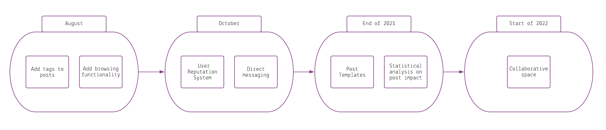

# HeroCall

A basic GitHub repository example for new [Call for Code](https://developer.ibm.com/callforcode/) projects and those that join the Call for Code with The Linux Foundation deployment initiative. Not all sections or files are required. You can make this as simple or as in-depth as you need. And don't forget to [register for Call for Code 2021](https://developer.ibm.com/callforcode/get-started/)!

> If you're new to open source, please consider taking the [free "Introduction to Open Source" class](https://cognitiveclass.ai/courses/introduction-to-open-source).

_Read this in other languages: [English](README.md), [한국어](./docs/README.ko.md), [português](./docs/README.pt_br.md)._

## Contents

- [Submission or project name](#submission-or-project-name)
  - [Contents](#contents)
  - [Short description](#short-description)
    - [What's the problem?](#whats-the-problem)
    - [How can technology help?](#how-can-technology-help)
    - [The idea](#the-idea)
  - [Demo video](#demo-video)
  - [The architecture](#the-architecture)
  - [Long description](#long-description)
  - [Project roadmap](#project-roadmap)
  - [Getting started](#getting-started)
  - [Live demo](#live-demo)
  - [Built with](#built-with)
  - [Authors](#authors)
  - [License](#license)
  - [Acknowledgments](#acknowledgments)

## Short description
HeroCall is a collaborative platform to solve issues anywhere in the globe.

### What's the problem?

Part of the World Health Organization's guidance on limiting further spread of COVID-19 is to practice social distancing. As a result, schools in most affected areas are taking precautionary measures by closing their facilities. With school-aged children at home for an indeterminate amount of time, keeping them engaged, entertained, and on top of their education is important.

### How can technology help?

Schools and teachers can continue to engage with their students through virtual classrooms, and even create interactive spaces for classes. As parents face a new situation where they may need to homeschool their children, finding appropriate online resources is important as well.

### The idea

It's imperative that learning and creating can continue when educational institutions have to shift the way they teach in times of crises, such as the COVID-19 pandemic. Providing a set of open source tools, backed by IBM Cloud and Watson Services, will enable educators to more easily make content available for their students.

## Demo video

## The architecture

1. The user navigates to the site.
2. The Django server recieves the request.
3. It makes a query to the local database to access the requested post(s).
4. The result is sent back to the user in a neat way.

## Long description

[More detail is available here](./DESCRIPTION.md)

## Project roadmap

The platform currently does the following things.

- Post creation.
- Horizontal replies.
- Different tabs for a post.

In the coming months, we plan to add some features to make this platform ready for production. Some of them are:
- Voting system for best replies and solutions.
- Collaborative space for brain storming.
- Browsing feature.

This is just the begining. HeroCall has the potential to help a lot of people all around the world. We will become this idea into a real impactful platform.

See below for our proposed schedule on next steps after Call for Code 2021 submission.

## Getting started

To get started using our code, clone the repository. Next, run the following commands from your directory:

- Create a virtual environment and install all the packages:
  - `cd heronet`
  - `python -m venv venv`
  - `pip install -r requirements.txt`
- Run the local server:
  - `cd heroweb'
  - `python manage.py runserver`

The server will be running at 127.0.0.1:8000

## Live demo

You can find the live demo at [herocall.eu-gb.mybluemix.net](https://herocall.eu-gb.mybluemix.net/).

## Built with

- [IBM Cloud Foundry](https://cloud.ibm.com/cloudfoundry/overview) - Container and hosting service
- [Python Django App](https://cloud.ibm.com/developer/appservice/create-app?starterKit=5ef1a664-8ff5-3ebb-b6d2-a8478e3cb789&defaultLanguage=undefined) - Starter kid to run Django
- [Django](https://www.djangoproject.com/) - Web framework used

## Authors

We are 4 engineering students from University College Dublin (Ireland)
- [Patrick Tallon](https://github.com/PatrickTallon)
- [Ella-Cyndy Banjoko-Johnson](https://github.com/THExR0CKxJoHNSoN)
- [Evanna Niall](https://github.com/evannaniall)
- [Daniel Álvarez Carreño](https://github.com/TuHechiceroFavorito)

## License

This project is licensed under the Apache 2 License - see the [LICENSE](LICENSE) file for details.

## Acknowledgments

- Based on [Call for Code's README template](https://github.com/Call-for-Code/Project-Sample).
