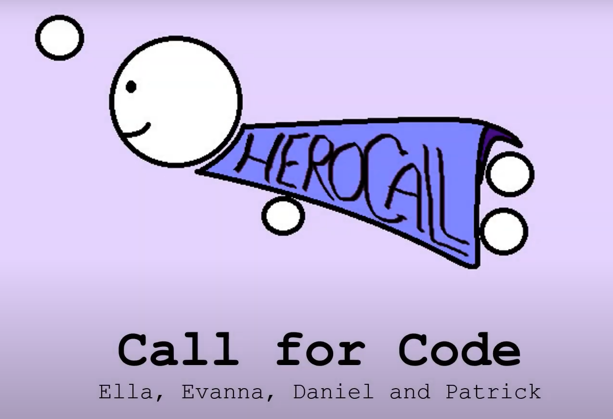
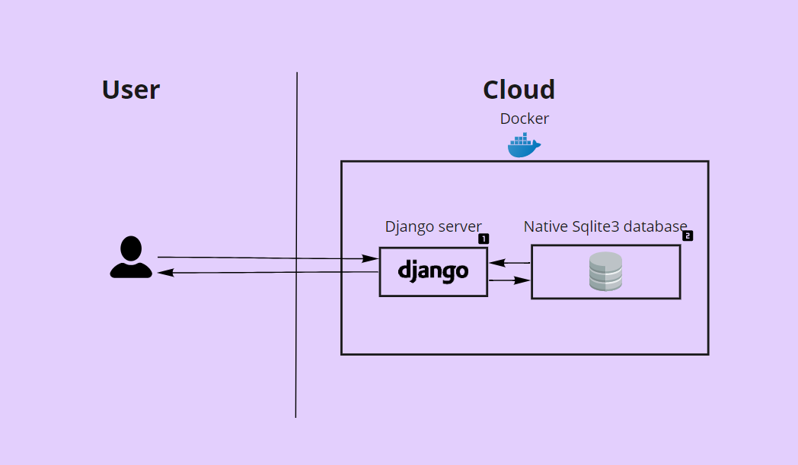

# HeroCall

HeroCall is our solution to the challenge proposed by [Call for Code](https://developer.ibm.com/callforcode/). We aim to target **all** the  categories that the challenge proposes. HeroCall is an ambitious and potentially very impactful project that will help a lot of people in the world.

## Contents

- [HeroCall](#herocall)
  - [Contents](#contents)
  - [Short description](#short-description)
    - [What's the problem?](#whats-the-problem)
    - [The idea](#the-idea)
  - [Demo video](#demo-video)
  - [The architecture](#the-architecture)
  - [Long description](#long-description)
  - [Project roadmap](#project-roadmap)
  - [Getting started](#getting-started)
  - [Live demo](#live-demo)
  - [Built with](#built-with)
  - [Authors](#authors)
  - [License](#license)
  - [Acknowledgments](#acknowledgments)

## Short description
HeroCall is a collaborative platform to solve issues anywhere in the globe.

### What's the problem?

There is a lack of information and knowledge in underdeveloped areas. This knowledge is abundant and easily accesible in other parts of the world. Any issues faced by those with better access to information are more likely to be overcome. Yet, people with no knowledge have less of a means to solve their problems. We see this as inherently unfair, as it means that the people in greater need are the ones with less opportunity to fix their issues.

### The idea

HeroCall aims to bridge this gap. It will connect people that have knowledge with people that need it. Potentially, it is a means of solving any issues anyone has. It will be a web-based platform. The fact that it is a website makes it highly accesible. People only need a device with a browser and internet connection. This actually means that really basic hardware is sufficient, which helps bridge any technological gap. This was the lowest hardware requirement level the team came up with in order to reach as many people as possible.

## Demo video

## The architecture

1. The user navigates to the site.
2. The Django server recieves the request.
3. It makes a query to the local database to access the requested post(s).
4. The result is sent back to the user in a neat way.

## Long description

[More detail is available here](./DESCRIPTION.md)

## Project roadmap

The platform currently does the following things.

- Post creation.
- Horizontal replies.
- Different, customizable tabs for a post.

In the coming months, we aim to add some features while making improvements to make this platform ready for use. Proposed changes include:
- Voting system for best replies and solutions.
- Automatic translation of all text to the language of the reader.
- Workspace for brain storming and collaboration between users.
- A more intuitive and aesthetically pleasing UI.
- Browsing feature.

See below for our proposed schedule on next steps after Call for Code 2021 submission.

This is just the begining. HeroCall has the potential to help a lot of people all around the world. We hope that we can shape this into a real impactful platform.

## Getting started

To get started using our code, clone the repository. Next, run the following commands from your directory:

- Create a virtual environment and install all the packages:
  - `python -m venv venv`
  - `pip install -r requirements.txt`
- Run the local server:
  - `cd heroweb`
  - `python manage.py runserver`

The server will be running at 127.0.0.1:8000

## Live demo

You can find the live demo at [herocall.eu-gb.mybluemix.net](https://herocall.eu-gb.mybluemix.net/).

## Built with

- [IBM Cloud Foundry](https://cloud.ibm.com/cloudfoundry/overview) - Container and hosting service.
- [Python Django App](https://cloud.ibm.com/developer/appservice/create-app?starterKit=5ef1a664-8ff5-3ebb-b6d2-a8478e3cb789&defaultLanguage=undefined) - Starter kit to run Django used to start the demo.
- [Django](https://www.djangoproject.com/) - Web framework used.

## Authors

We are 4 engineering students from University College Dublin (Ireland)
- [Patrick Tallon](https://github.com/PatrickTallon)
- [Ella-Cyndy Banjoko-Johnson](https://github.com/THExR0CKxJoHNSoN)
- [Evanna Niall](https://github.com/evannaniall)
- [Daniel Álvarez Carreño](https://github.com/TuHechiceroFavorito)

## License

This project is licensed under the Apache 2 License - see the [LICENSE](LICENSE) file for details.

## Acknowledgments

- Based on [Call for Code's README template](https://github.com/Call-for-Code/Project-Sample).
